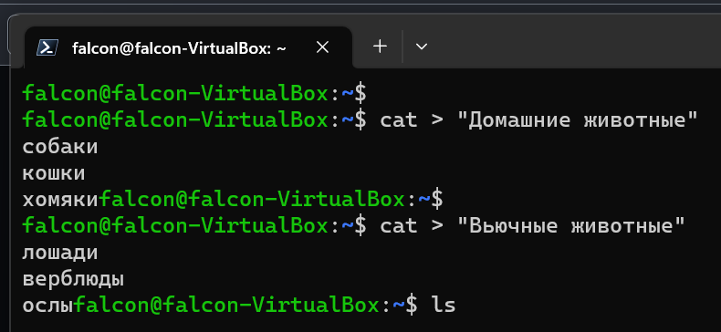
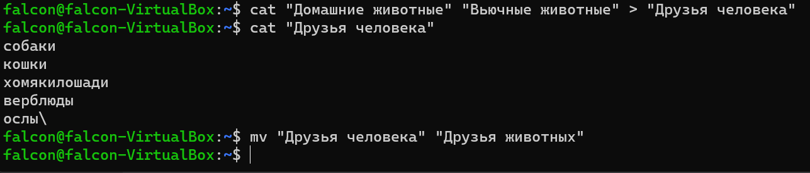
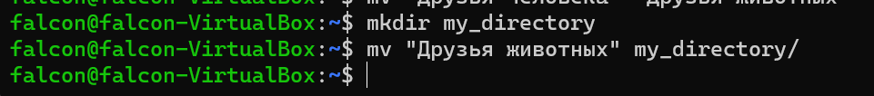

***Задание 1. Используя команду cat в терминале операционной системы Linux, создать
два файла Домашние животные (заполнив файл собаками, кошками,
хомяками) и Вьючные животными заполнив файл Лошадьми, верблюдами и
ослы), а затем объединить их. Просмотреть содержимое созданного файла.
Переименовать файл, дав ему новое имя (Друзья человека).***

* Создание файла "Домашние животные" и заполнение его содержимым:

``````
cat > "Домашние животные"
собаки
кошки
хомяки
Ctrl + D
``````
* Создание файла "Вьючные животные" и заполнение его содержимым:
``````
cat > "Вьючные животные"
лошади
верблюды
ослы
Ctrl + D
``````


* Объединение файлов с помощью команды cat:
``````
cat "Домашние животные" "Вьючные животные" > "Друзья человека"
``````
* Просмотр содержимого созданного файла:
``````
cat "Друзья человека"
``````
* Переименование файла "Друзья человека" на "Друзья животных":
``````
mv "Друзья человека" "Друзья животных"
``````




***Задание 2. Создать директорию, переместить файл туда.***

* Создание директории "my_directory":
``````
mkdir my_directory
``````
* Перемещение файла "Друзья животных" в созданную директорию:
``````
mv "Друзья животных" my_directory/
``````


