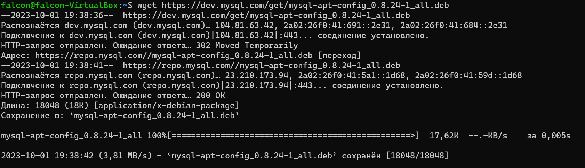
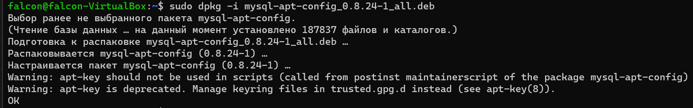
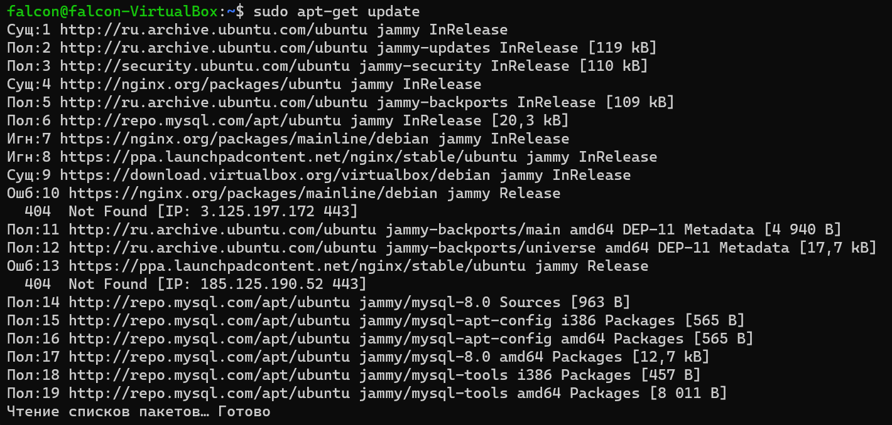
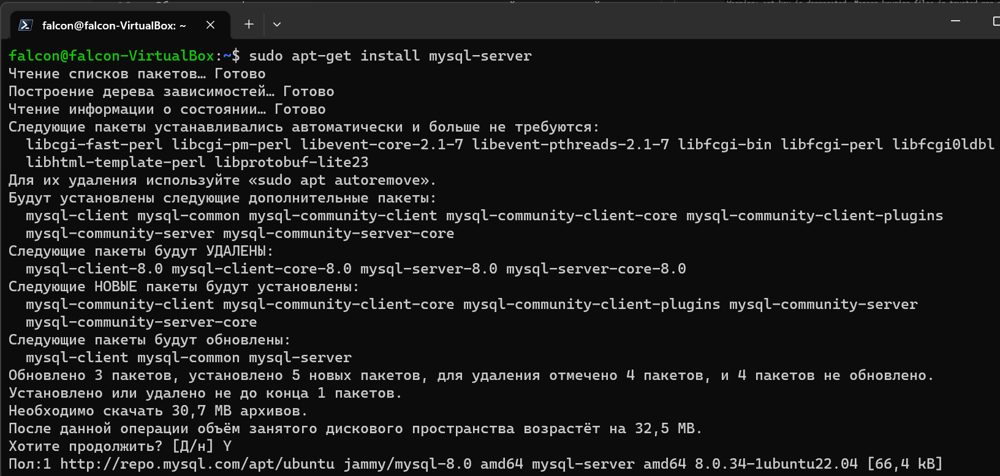
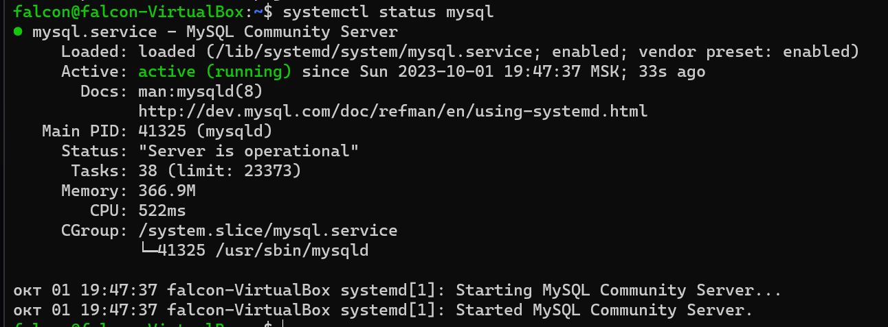
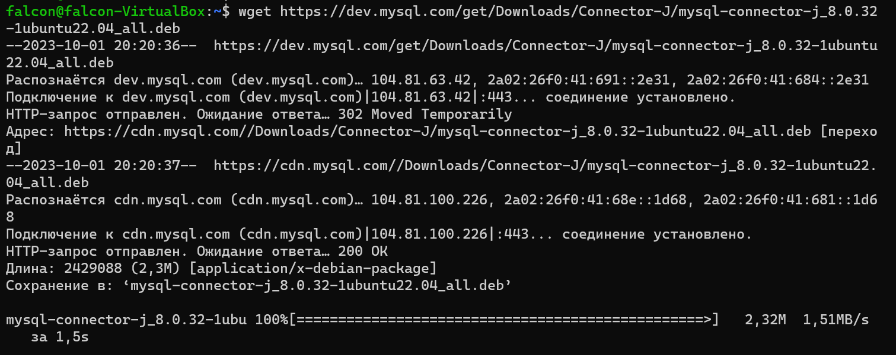
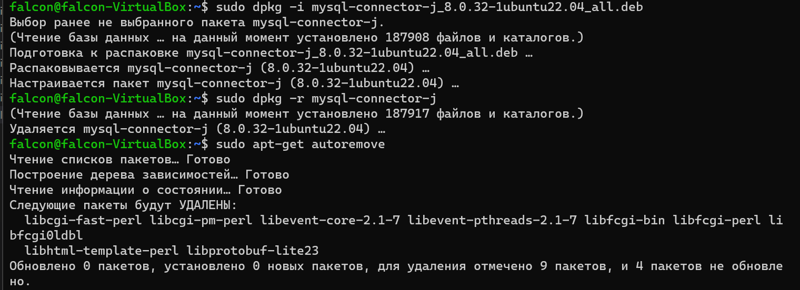
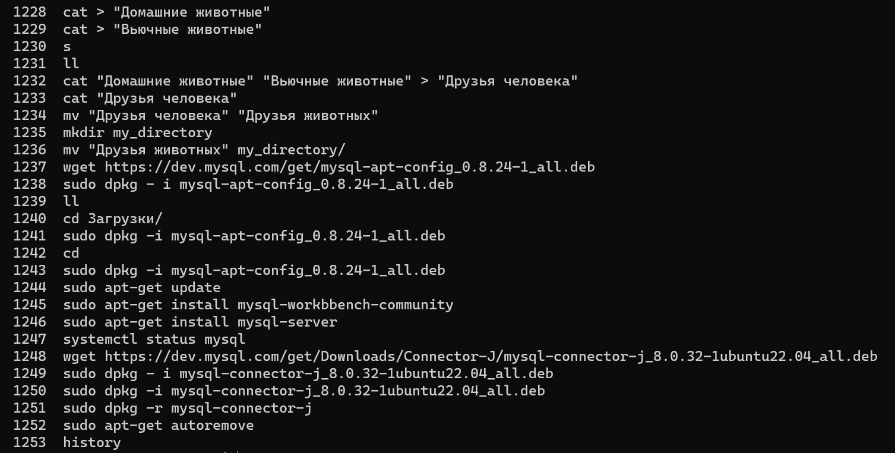

**3. Подключить дополнительный репозиторий MySQL. Установить любой пакет из этого репозитория.**

* Скачиваем конфигуратор mysql:

``````
wget https://dev.mysql.com/get/mysql-apt-config_0.8.24-1_all.deb

``````



* Устанавливаем компоненты mysql с помощью конфигуратора:

``````
sudo dpkg -i mysql-apt-config_0.8.24-1_all.deb
``````

* В процессе установки жмем Ок, чтобы выполнить полную установку



* Обновляем информацию о пакетах и видим подключенный репозиторий mysql:

``````
sudo apt-get update
``````



* Устанавливаем mysql-server:

``````
sudo apt-get install mysql-server
``````



* Проверяем результат установки:
``````
systemctl status mysql
``````



**4. Установить и удалить deb-пакет с помощью dpkg.**
* Скачиваем пакет для установки:
``````
wget https://dev.mysql.com/get/Downloads/Connector-J/mysql-connector-j_8.0.32-1ubuntu22.04_all.deb
``````

* Устанавливаем пакет mysql-connector-j_8.0.32-1ubuntu22.04_all.deb:
``````
sudo dpkg - i mysql-connector-j_8.0.32-1ubuntu22.04_all.deb
``````

* Удаляем пакет и его сопутствующие пакеты:
``````
sudo dpkg -r mysql-connector-j
sudo apt-get autoremove
``````


**5. Выложить историю команд в терминале ubuntu.
Для получения истории введенных команд в терминале ubuntu используем:**
``````
history
``````
